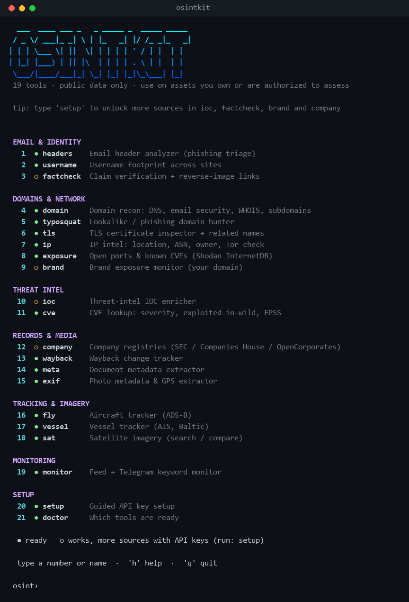
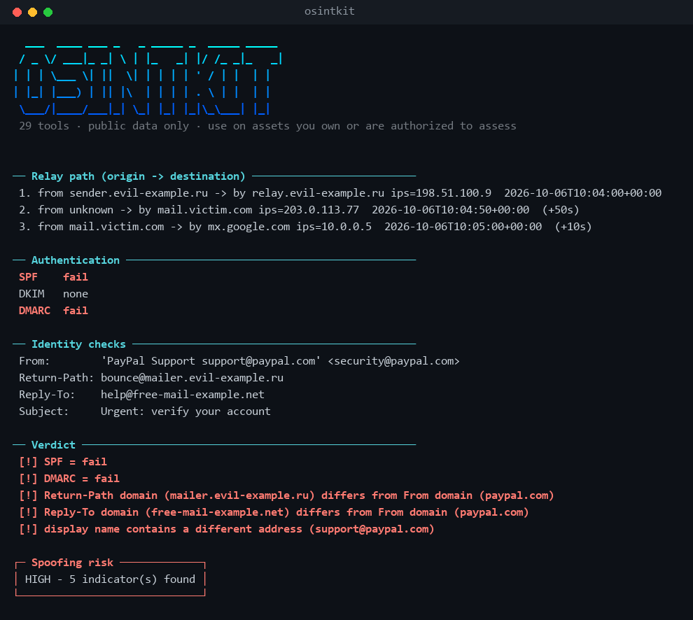

# osintkit

A stdlib-only Python CLI bundling 13 open-source-intelligence tools, with a colored interactive menu.


<p>
  
  
</p>

## Install & first run

```
pipx install git+https://github.com/Crepald-01/osintkit   # gives you a global `osintkit` command
osintkit                                                    # opens the menu; offers a 2-minute key setup on first launch
```

No pipx? Just clone and run `python osintkit.py` (Windows: `osintkit.bat`). Python 3.8+, no dependencies.

10 tools work with no keys at all. The rest (`ioc`, `company`, `brand`, `factcheck`) get more sources when you add free API keys:

```
osintkit setup                  # guided: quick start / everything / one tool; opens signup pages; checks each key as you paste it
osintkit setup --only ioc       # just the keys one tool uses
osintkit setup --set VT_API_KEY=xxxx --set ABUSEIPDB_KEY=yyyy   # non-interactive
osintkit setup --from-env .env  # import from a .env file (or the environment if no file given)
osintkit doctor                 # which tools are ready, and what each missing key unlocks
```

Keys are saved in plain text to `~/.osintkit/keys.json`; real environment variables take priority.

## Tools

| Command | Purpose |
|---|---|
| `headers` | Email header analyzer: relay path, SPF/DKIM/DMARC, spoof flags |
| `company` | SEC EDGAR / Companies House / OpenCorporates lookups |
| `wayback` | Diff archived versions of a page |
| `fly` / `vessel` | Aircraft (ADS-B) and ship (AIS) tracking, geofence alerts |
| `sat` | Sentinel-2 search and before/after comparison |
| `monitor` | Keyword monitor for RSS feeds and public Telegram channels |
| `meta` | Document metadata leak finder |
| `ioc` | IP/domain/URL/hash enrichment (VirusTotal, AbuseIPDB, URLhaus, GreyNoise) |
| `brand` | Brand exposure check (HIBP, GitHub, certificate transparency) |
| `factcheck` | Fact-check lookup and reverse-image links |
| `domain` | DNS, email security, RDAP, security headers, subdomains |
| `typosquat` | Find registered lookalike domains |
| `username` | Username footprint across ~28 sites |

Most tools need no key. Run `python osintkit.py doctor` to see which API keys are set.

## Responsible use
Public data only. Use on assets you own or are authorized to assess; do not use to profile or track private individuals.
